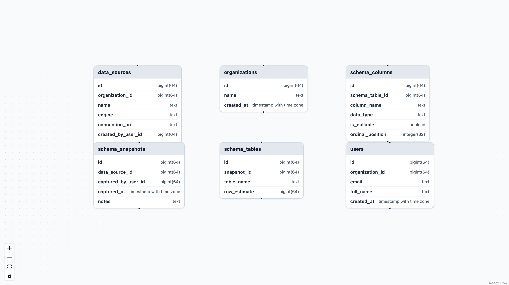

# SchemaLens


SchemaLens is a lightweight toolkit for exploring, visualizing, and understanding data schemas.

## Current Status



Current project status:
- Basic API returning database table schemas
- ERD generation using React Flow (XYFlow)

## Future Features

- Snapshot of schemas so you can see how the schema has evolved over time
- Misconfigurations of your db schema.

## Run Entire App in Docker

All services run in containers (frontend + Python API), so you do not need local Node or Python setup.

### Prerequisites

- Docker Desktop (or Docker Engine + Compose plugin)

### Start

From the repository root:

```bash
docker compose -f schemalens/infra/docker-compose.yml up --build
```

### URLs

- Frontend: http://localhost:5173
- API base: http://localhost:8000/api/v1
- Schema: http://localhost:8000/api/v1/schema

### Stop

```bash
docker compose -f schemalens/infra/docker-compose.yml down
```
