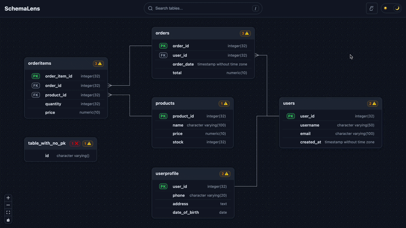

# SchemaLens


SchemaLens is a lightweight toolkit for exploring, visualizing, and understanding data schemas.

## Features

### Smart Search & Navigation


Quick table discovery with autocomplete suggestions and smooth navigation to any table in your schema.

- **Real-time Search** - Find tables as you type with intelligent filtering
- **Schema Visualization** - Interactive ERD with relationship mapping

### Smarter Schema Insights — Recommendations Sidebar



Get a clear picture of your database health at a glance with the redesigned Recommendations sidebar.

- **Schema Health Score** — An instant 0–100 score that weights errors, warnings, and info items so you always know where you stand
- **Statistics Dashboard** — Tiles showing total issues, error count, warning count, and info items front-and-centre before you dig in
- **Global View** — See every recommendation across your entire database in one place, with filtering by table and schema
- **Navigate to Any Table** — Click the eye icon on any recommendation to instantly fly to that table in the ERD diagram
- **Smart Filtering & Search** — Filter by severity, search by rule name, table, or description, and sort by priority, type, or table name
- **Resizable Panel** — Drag the sidebar to exactly the width you need

Whether you're doing a quick schema audit or a deep-dive into data quality, the new sidebar gives you everything you need without leaving the diagram.

## Run Entire App in Docker

All services run in containers (frontend + Python API), so you do not need local Node or Python setup.

### Prerequisites

- Docker Desktop (or Docker Engine + Compose plugin)

### Start

From the repository root:

```bash
docker compose -f schemalens/infra/docker-compose.yml up --build
```

### Stop

```bash
docker compose -f schemalens/infra/docker-compose.yml down
```
