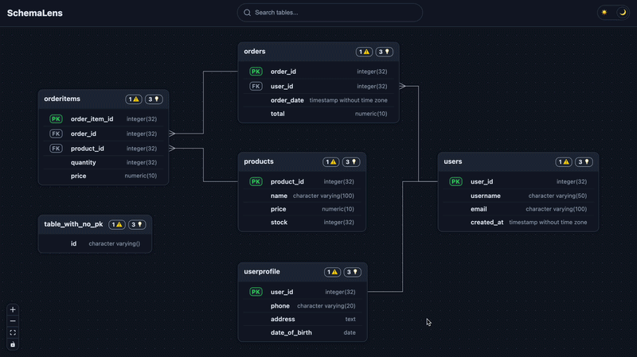

# SchemaLens


SchemaLens is a lightweight toolkit for exploring, visualizing, and understanding data schemas.

## Features

### Smart Search & Navigation


Quick table discovery with autocomplete suggestions and smooth navigation to any table in your schema.

- **Real-time Search** - Find tables as you type with intelligent filtering
- **Schema Visualization** - Interactive ERD with relationship mapping

## Run Entire App in Docker

All services run in containers (frontend + Python API), so you do not need local Node or Python setup.

### Prerequisites

- Docker Desktop (or Docker Engine + Compose plugin)

### Start

From the repository root:

```bash
docker compose -f schemalens/infra/docker-compose.yml up --build
```

### Stop

```bash
docker compose -f schemalens/infra/docker-compose.yml down
```
